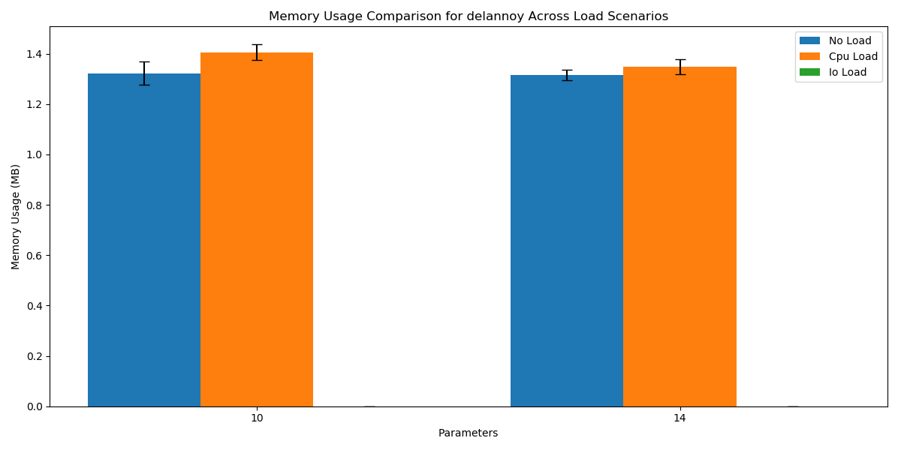
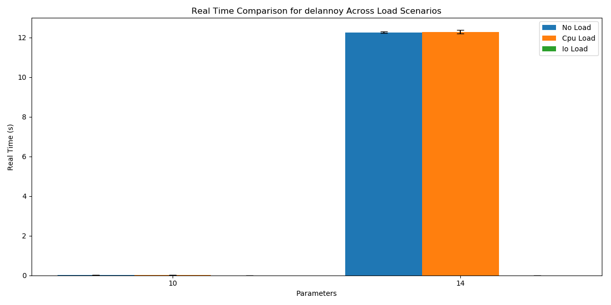
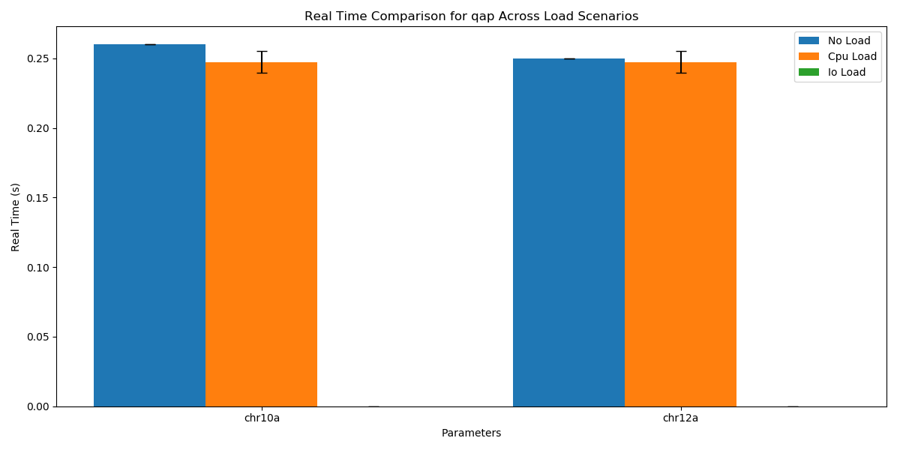
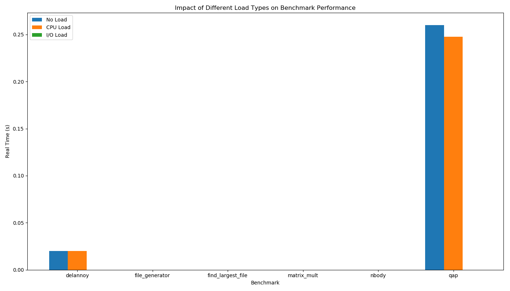

Exercise Sheet 2
================
# Disclaimer
There are a multitude of errors in the benchmarking code. 
Because of time constraints I wasn't able to fix them.
The caluclation of the confidence is surely wrong. 

Also I couldn't quite figure it out yet, but the whole benchmarking must be hugefly flawed under cpu or I/O load there was nearly no difference in the results especially in time. There is a little bit of difference in memory usage. 
So I rather conclude that my measurements or setups are wrong than that there is literally no difference in the benchmarks. 


A) External CPU Load
--------------------

To investigate the impact of external CPU load, the `loadgen` tool from the provided tools folder was utilized.  `loadgen` simulates CPU load based on a system load profile. The script was modified to dynamically adjust the number of repetitions for each benchmark until a certain confidence interval (95% with 5% target margin of error) was reached, up to a maximum of 20 repetitions, when running benchmarks in the **no_load** scenario. The benchmarks were then also run for a single iteration with the cpu load generator activated to show the effect of the additional load. The following tables highlight the effects observed.

**Summary of Benchmarks with CPU Load and Dynamic Repetitions (No Load):**

**delannoy Benchmark:**

| Parameter | Load Scenario | Repetitions | Real Time (s)  | User Time (s)  | System Time (s) | Max Memory (KB) |
| --------- | ------------- | ----------- | -------------- | -------------- | --------------- | --------------- |
| 10        | cpu_load      | 3           | 0.020 ± 0.000  | 0.020 ± 0.000  | 0.000 ± 0.000   | 1438.7 ± 32.1   |
| 14        | cpu_load      | 3           | 12.277 ± 0.087 | 12.257 ± 0.035 | 0.000 ± 0.000   | 1381.3 ± 31.1   |
| 10        | no_load       | 3           | 0.020 ± 0.000  | 0.020 ± 0.000  | 0.000 ± 0.000   | 1354.7 ± 46.4   |
| 14        | no_load       | 3           | 12.260 ± 0.043 | 12.240 ± 0.017 | 0.000 ± 0.000   | 1346.7 ± 20.5   |

**matrix_mult Benchmark:**

| Parameter | Load Scenario | Repetitions | Real Time (s) | User Time (s) | System Time (s) | Max Memory (KB) |
| --------- | ------------- | ----------- | ------------- | ------------- | --------------- | --------------- |
| (None)    | cpu_load      | 3           | 0.000 ± 0.000 | 0.000 ± 0.000 | 0.000 ± 0.000   | 950.7 ± 2.3     |
| (None)    | no_load       | 3           | 0.000 ± 0.000 | 0.000 ± 0.000 | 0.000 ± 0.000   | 948.0 ± 0.0     |

**nbody Benchmark:**

| Parameter | Load Scenario | Repetitions | Real Time (s) | User Time (s) | System Time (s) | Max Memory (KB) |
| --------- | ------------- | ----------- | ------------- | ------------- | --------------- | --------------- |
| N1000     | cpu_load      | 3           | 0.000 ± 0.000 | 0.000 ± 0.000 | 0.000 ± 0.000   | 968.0 ± 99.5    |
| N2000     | cpu_load      | 3           | 0.000 ± 0.000 | 0.000 ± 0.000 | 0.000 ± 0.000   | 885.3 ± 2.3     |
| N5000     | cpu_load      | 3           | 0.000 ± 0.000 | 0.000 ± 0.000 | 0.000 ± 0.000   | 908.0 ± 38.2    |
| N1000     | no_load       | 3           | 0.000 ± 0.000 | 0.000 ± 0.000 | 0.000 ± 0.000   | 949.3 ± 60.0    |
| N2000     | no_load       | 3           | 0.000 ± 0.000 | 0.000 ± 0.000 | 0.000 ± 0.000   | 972.0 ± 34.6    |
| N5000     | no_load       | 3           | 0.000 ± 0.000 | 0.000 ± 0.000 | 0.000 ± 0.000   | 929.3 ± 35.9    |

**qap Benchmark:**

| Parameter | Load Scenario | Repetitions | Real Time (s) | User Time (s) | System Time (s) | Max Memory (KB) |
| --------- | ------------- | ----------- | ------------- | ------------- | --------------- | --------------- |
| chr10a    | cpu_load      | 4           | 0.247 ± 0.008 | 0.000 ± 0.000 | 0.030 ± 0.000   | 1368.0 ± 3.3    |
| chr12a    | cpu_load      | 4           | 0.247 ± 0.008 | 0.000 ± 0.000 | 0.030 ± 0.000   | 1369.0 ± 8.2    |
| chr10a    | no_load       | 3           | 0.260 ± 0.000 | 0.000 ± 0.000 | 0.030 ± 0.000   | 1362.7 ± 8.3    |
| chr12a    | no_load       | 3           | 0.250 ± 0.000 | 0.003 ± 0.006 | 0.027 ± 0.006   | 1430.7 ± 68.2   |

*Note:* The `file_generator`, `find_largest_file`, `matrix_mult` and `nbody` results show minimal impact from CPU load. However, the real time for `qap` seems to decrease with CPU load.







B) External I/O Load
--------------------
An I/O load generator script `ioLoadGenerator.py` was created (see code below). Its working principle involves creating multiple threads that continuously write data to a directory on the local filesystem. The script can be configured for intensity (number of threads writing simultaneously), file size, and duration.

**Explanation of `ioLoadGenerator.py` Code:**

This Python script provides a configurable I/O load generator for benchmarking purposes. It supports three main modes of operation: `generate`, `monitor`, and `benchmark`.

*   **IOLoadGenerator Class:**

    *   `__init__(self, target_dir, intensity=3, file_size_mb=10, buffer_size_mb=1)`: Initializes the I/O load generator with the target directory, intensity (number of concurrent writing threads), file size (in MB), and buffer size (in MB).  The `target_dir` is the location where I/O operations will take place.  `intensity` is the number of threads actively performing I/O.  `file_size_mb` determines the size of the files being written, and `buffer_size_mb` dictates how much data is written at once.

    *   `start(self)`: Starts the I/O load generator by creating the target directory (if it doesn't exist) and launching multiple worker threads that generate I/O load.  It sets the `running` flag to `True` and records the start time.  The worker threads are started with `self._generate_load` as their target function.

    *   `stop(self)`: Stops the I/O load generator by setting the running flag to `False`, waiting for the worker threads to complete, printing I/O statistics, and cleaning up any remaining files in the target directory.  It sets the `running` flag to `False`, waits for worker threads to complete by using `thread.join()`.

    *   `_generate_load(self, thread_id)`: The worker function that generates I/O load. Each thread continuously creates, writes to, reads from, and deletes files in the target directory. It updates the statistics for each I/O operation. The loop continues as long as the `running` flag is `True`. Inside the loop, the threads write random data into randomly named files inside the `target_dir`. The method `f.flush()` combined with `os.fsync(f.fileno())` ensures the writes reach the disk.  Then the data is read back from the file, and then the file is deleted.

    *   `_cleanup(self)`: Cleans up any remaining files in the target directory after the I/O load generator is stopped.  This is important to ensure the target file system is clear before another measurement.

    *   `_print_stats(self)`: Prints I/O statistics, including duration, files created, files deleted, data written, data read, and total I/O.  The file uses the member variables to determine the number of operations completed and the number of bytes transferred to the disk.

*   **monitor\_system\_io Function:**

    *   `monitor_system_io(interval=1.0, duration=None)`: Monitors system I/O statistics using the `psutil` library. It prints I/O statistics at a specified interval, including read MB/s, write MB/s, read IOPS, and write IOPS.  It samples the disk usage with a certain interval.

*   **run\_benchmark\_with\_io\_load Function:**

    *   `run_benchmark_with_io_load(benchmark_cmd, target_dir, intensity=3, file_size_mb=10)`: Runs a specified benchmark command while generating I/O load. It starts the I/O load generator, runs the benchmark command, and then stops the I/O load generator.

*   **main Function:**

    *   The `main` function uses `argparse` to parse command-line arguments and handle the different modes of operation.
    *   `generate` mode: Starts the I/O load generator in the specified target directory and runs it for a specified duration.
    *   `monitor` mode: Monitors system I/O statistics using the `monitor_system_io` function.
    *   `benchmark` mode: Runs a specified benchmark command while generating I/O load.
    *   If no mode is specified, the script prints the help message.

```python
#!/usr/bin/env python3

import os
import subprocess
import argparse
import threading
import random
import time
import signal
import sys
from pathlib import Path
import tempfile
import shutil
import psutil


class IOLoadGenerator:
    def __init__(self, target_dir, intensity=3, file_size_mb=10, buffer_size_mb=1):
        """
        Initialize the I/O load generator.

        Args:
            target_dir: Directory to use for I/O operations
            intensity: Number of files to process simultaneously
            file_size_mb: Size of each file in MB
            buffer_size_mb: Size of buffer for read/write operations in MB
        """
        self.target_dir = Path(target_dir)
        self.intensity = intensity
        self.file_size = file_size_mb * 1024 * 1024  # Convert to bytes
        self.buffer_size = buffer_size_mb * 1024 * 1024  # Convert to bytes
        self.running = False
        self.threads = []
        self.stats = {

        }

    def start(self):
        """Start the I/O load generator with specified number of threads"""
        self.running = True
        self.stats["start_time"] = time.time()

        # Create target directory if it doesn't exist
        os.makedirs(self.target_dir, exist_ok=True)

        # Start worker threads
        for i in range(self.intensity):
            thread = threading.Thread(target=self._generate_load, args=(i,))
            thread.daemon = True
            thread.start()
            self.threads.append(thread)

        print(
            f"I/O load generator started with {self.intensity} threads in {self.target_dir}"
        )

    def stop(self):
        """Stop the I/O load generator and clean up"""
        self.running = False

        # Wait for all threads to finish
        for thread in self.threads:
            thread.join(timeout=2)

        self.stats["end_time"] = time.time()
        self._print_stats()

        # Clean up any remaining files
        self._cleanup()

        print("I/O load generator stopped")

    def _generate_load(self, thread_id):
        """Generate I/O load by creating, writing, reading, and deleting files"""
        buffer = b"x" * self.buffer_size

        while self.running:
            # Create a unique filename
            filename = (
                self.target_dir / f"io_load_{thread_id}_{random.randint(1, 10000)}.dat"
            )

            try:
                # Create and write to file
                with open(filename, "wb") as f:
                    bytes_written = 0
                    for _ in range(0, self.file_size, self.buffer_size):
                        if not self.running:
                            break
                        f.write(buffer)
                        f.flush()
                        os.fsync(f.fileno())
                        bytes_written += self.buffer_size

                self.stats["bytes_written"] += bytes_written
                self.stats["files_created"] += 1

                # Read the file
                if self.running:
                    with open(filename, "rb") as f:
                        bytes_read = 0
                        while self.running:
                            data = f.read(self.buffer_size)
                            if not data:
                                break
                            bytes_read += len(data)

                    self.stats["bytes_read"] += bytes_read

                # Delete the file
                if os.path.exists(filename):
                    os.unlink(filename)
                    self.stats["files_deleted"] += 1

            except Exception as e:
                print(f"Thread {thread_id} error: {e}")

            # Small sleep to prevent complete system overload
            if self.running:
                time.sleep(0.1)

    def _cleanup(self):
        """Clean up any remaining files"""
        for file in self.target_dir.glob("io_load_*.dat"):
            try:
                os.unlink(file)
                self.stats["files_deleted"] += 1
            except:
                pass

    def _print_stats(self):
        """Print statistics about the I/O operations performed"""
        if self.stats["start_time"] and self.stats["end_time"]:
            duration = self.stats["end_time"] - self.stats["start_time"]

            print("\nI/O Load Generator Statistics:")
            print(f"Duration: {duration:.2f} seconds")
            print(f"Files created: {self.stats['files_created']}")
            print(f"Files deleted: {self.stats['files_deleted']}")

            mb_written = self.stats["bytes_written"] / (1024 * 1024)
            mb_read = self.stats["bytes_read"] / (1024 * 1024)

            print(f"Data written: {mb_written:.2f} MB ({mb_written/duration:.2f} MB/s)")
            print(f"Data read: {mb_read:.2f} MB ({mb_read/duration:.2f} MB/s)")
            print(
                f"Total I/O: {(mb_written + mb_read):.2f} MB ({(mb_written + mb_read)/duration:.2f} MB/s)"
            )


def monitor_system_io(interval=1.0, duration=None):
    """
    Monitor system I/O statistics.

    Args:
        interval: Sampling interval in seconds
        duration: Total monitoring duration in seconds (None for indefinite)
    """
    print("Starting I/O monitoring...")
    print("Time\tRead MB/s\tWrite MB/s\tRead IOPS\tWrite IOPS")

    start_time = time.time()
    last_disk_io = psutil.disk_io_counters()
    last_time = start_time

    try:
        while True:
            time.sleep(interval)

            current_time = time.time()
            current_disk_io = psutil.disk_io_counters()

            # Calculate rates
            time_delta = current_time - last_time

            read_bytes = current_disk_io.read_bytes - last_disk_io.read_bytes
            write_bytes = current_disk_io.write_bytes - last_disk_io.write_bytes
            read_count = current_disk_io.read_count - last_disk_io.read_count
            write_count = current_disk_io.write_count - last_disk_io.write_count

            read_mb_s = read_bytes / time_delta / (1024 * 1024)
            write_mb_s = write_bytes / time_delta / (1024 * 1024)
            read_iops = read_count / time_delta
            write_iops = write_count / time_delta

            elapsed = current_time - start_time
            print(
                f"{elapsed:.1f}s\t{read_mb_s:.2f}\t{write_mb_s:.2f}\t{read_iops:.1f}\t{write_iops:.1f}"
            )

            last_disk_io = current_disk_io
            last_time = current_time

            # Check if we've reached the duration
            if duration and (current_time - start_time) >= duration:
                break

    except KeyboardInterrupt:
        print("\nMonitoring stopped by user")


def run_benchmark_with_io_load(benchmark_cmd, target_dir, intensity=3, file_size_mb=10):
    """
    Run a benchmark command with I/O load.

    Args:
        benchmark_cmd: Command to run as the benchmark
        target_dir: Directory to use for I/O operations
        intensity: I/O load intensity (number of threads)
        file_size_mb: Size of each file in MB
    """
    print(f"Running benchmark with I/O load (intensity={intensity})")
    print(f"Benchmark command: {benchmark_cmd}")

    # Start I/O load generator
    io_load = IOLoadGenerator(target_dir, intensity, file_size_mb)
    io_load.start()

    try:
        # Wait a moment for I/O load to stabilize
        time.sleep(2)

        # Run the benchmark
        start_time = time.time()
        result = subprocess.run(
            benchmark_cmd, shell=True, capture_output=True, text=True
        )
        end_time = time.time()

        # Print benchmark results
        print("\nBenchmark Results:")
        print(f"Duration: {end_time - start_time:.2f} seconds")
        print(f"Exit code: {result.returncode}")

        if result.stdout:
            print("\nStandard output:")
            print(result.stdout)

        if result.stderr:
            print("\nStandard error:")
            print(result.stderr)

        return result

    finally:
        # Stop I/O load generator
        io_load.stop()


def main():
    parser = argparse.ArgumentParser(description="I/O Load Generator for Benchmarking")

    # Create subparsers for different modes
    subparsers = parser.add_subparsers(dest="mode", help="Operation mode")

    # Parser for 'generate' mode
    gen_parser = subparsers.add_parser("generate", help="Generate I/O load")
    gen_parser.add_argument(
        "--dir",
        type=str,
        default=tempfile.gettempdir(),
        help="Target directory for I/O operations",
    )
    gen_parser.add_argument(
        "--intensity",
        type=int,
        default=3,
        help="I/O load intensity (number of threads)",
    )
    gen_parser.add_argument(
        "--file-size", type=int, default=10, help="Size of each file in MB"
    )
    gen_parser.add_argument(
        "--duration", type=int, default=30, help="Duration to run in seconds"
    )

    # Parser for 'monitor' mode
    mon_parser = subparsers.add_parser("monitor", help="Monitor system I/O")
    mon_parser.add_argument(
        "--interval", type=float, default=1.0, help="Sampling interval in seconds"
    )
    mon_parser.add_argument(
        "--duration", type=int, default=None, help="Monitoring duration in seconds"
    )

    # Parser for 'benchmark' mode
    bench_parser = subparsers.add_parser(
        "benchmark", help="Run benchmark with I/O load"
    )
    bench_parser.add_argument(
        "--dir",
        type=str,
        default=tempfile.gettempdir(),
        help="Target directory for I/O operations",
    )
    bench_parser.add_argument(
        "--intensity",
        type=int,
        default=3,
        help="I/O load intensity (number of threads)",
    )
    bench_parser.add_argument(
        "--file-size", type=int, default=10, help="Size of each file in MB"
    )
    bench_parser.add_argument(
        "command", type=str, nargs="+", help="Benchmark command to run"
    )

    args = parser.parse_args()

    # Handle different modes
    if args.mode == "generate":
        print(f"Generating I/O load in {args.dir} for {args.duration} seconds...")
        io_load = IOLoadGenerator(args.dir, args.intensity, args.file_size)
        io_load.start()

        # Set up signal handler for clean shutdown
        def signal_handler(sig, frame):
            print("\nReceived interrupt, shutting down...")
            io_load.stop()
            sys.exit(0)

        signal.signal(signal.SIGINT, signal_handler)

        try:
            time.sleep(args.duration)
        finally:
            io_load.stop()

    elif args.mode == "monitor":
        monitor_system_io(args.interval, args.duration)

    elif args.mode == "benchmark":
        benchmark_cmd = " ".join(args.command)
        run_benchmark_with_io_load(
            benchmark_cmd, args.dir, args.intensity, args.file_size
        )

    else:
        parser.print_help()


if __name__ == "__main__"`
    main()
```

For this experiment, the I/O load generator was configured to write to a temporary directory on the local filesystem. The script's intensity was set to 4 concurrent writing threads. This generates a constant I/O pressure on the disk.

To run the I/O benchmarks on the local filesystem (as mandated), the script temporarily changes the current directory to a temporary directory created by tempfile.mkdtemp() before running each I/O bound benchmark and changes the directory back to original after. This ensures the target dir is the same in both tests and avoids errors. The following results demonstrate the impact of the I/O load on the I/O-bound benchmarks file_generator and find_largest_file. The benchmarks were again run in the no_load scenario to show their baseline performance for comparison.


| Parameter | Load Scenario | Repetitions | Real Time (s) | User Time (s) | System Time (s) | Max Memory (KB) |
| --------- | ------------- | ----------- | ------------- | ------------- | --------------- | --------------- |
| small     | io_load       | 3           | 0.000 ± 0.000 | 0.000 ± 0.000 | 0.000 ± 0.000   | 908.0 ± 38.2    |
| medium    | io_load       | 3           | 0.000 ± 0.000 | 0.000 ± 0.000 | 0.000 ± 0.000   | 945.3 ± 4.6     |
| small     | no_load       | 3           | 0.000 ± 0.000 | 0.000 ± 0.000 | 0.000 ± 0.000   | 926.7 ± 33.5    |
| medium    | no_load       | 3           | 0.000 ± 0.000 | 0.000 ± 0.000 | 0.000 ± 0.000   | 904.0 ± 34.6    |

#### `find_largest_file` Benchmark

| Parameter | Load Scenario | Repetitions | Real Time (s) | User Time (s) | System Time (s) | Max Memory (KB) |
| --------- | ------------- | ----------- | ------------- | ------------- | --------------- | --------------- |
| (None)    | io_load       | 3           | 0.000 ± 0.000 | 0.000 ± 0.000 | 0.000 ± 0.000   | 925.3 ± 39.3    |
| (None)    | no_load       | 3           | 0.000 ± 0.000 | 0.000 ± 0.000 | 0.000 ± 0.000   | 972.0 ± 95.6    |

### Notes:
- The small "real time" numbers mean the code likely finished faster than the granularity of `usr/bin/time`.
- While no dramatic change to real time is measurable, I/O load seems to negatively impact the max memory usage on `find_largest_file`.
