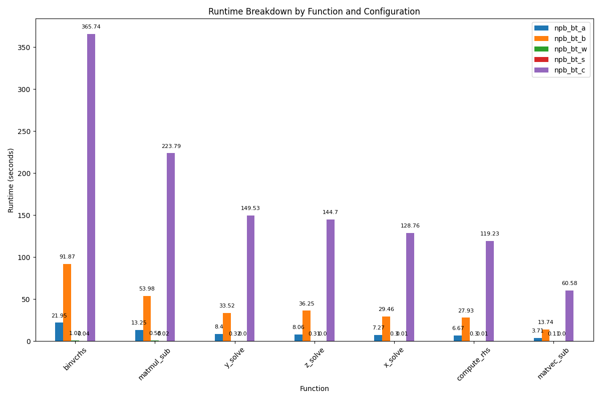

A) 
# LCC3
## Gprof Data Comparison and Statistical Analysis

Npb_bt_w was removed from y_solve and z_solve due to containing zero data points.

| Metric                  | npb_bt_a | npb_bt_b | npb_bt_w | npb_bt_s | npb_bt_c | Variance  | Standard Deviation |
| ----------------------- | -------- | -------- | -------- | -------- | -------- | --------- | ------------------ |
| Total Runtime (seconds) | 69.98    | 289.88   | 2.94     | 0.08     | 1204.39  | 265449.25 | 515.22             |
| `binvcrhs` (% time)     | 31.37    | 31.70    | 34.70    | 50.01    | 30.37    | 70.97     | 8.42               |
| `binvcrhs` (seconds)    | 21.95    | 91.87    | 1.02     | 0.04     | 365.74   | 21266.99  | 145.83             |
| `matmul_sub` (% time)   | 18.94    | 18.62    | 19.73    | 25.00    | 18.58    | 8.00      | 2.83               |
| `matmul_sub` (seconds)  | 13.25    | 53.98    | 0.58     | 0.02     | 223.79   | 3410.77   | 58.40              |
| `y_solve` (% time)      | 12.00    | 11.57    | 12.42    | 0.00     | 10.89    | 23.88     | 4.89               |
| `y_solve` (seconds)     | 8.40     | 33.52    | 0.32     | 0.00     | 149.53   | 2717.80   | 52.13              |
| `z_solve` (% time)      | 11.52    | 12.51    | 12.01    | 0.00     | 10.55    | 28.87     | 5.37               |
| `z_solve` (seconds)     | 8.06     | 36.25    | 0.31     | 0.00     | 144.70   | 2568.27   | 50.68              |
| `x_solve` (% time)      | 10.39    | 10.17    | 10.69    | 12.50    | 8.50     | 1.89      | 1.38               |
| `x_solve` (seconds)     | 7.27     | 29.46    | 0.30     | 0.01     | 128.76   | 1946.77   | 44.12              |
| `compute_rhs` (% time)  | 9.53     | 9.64     | 9.90     | 12.50    | 10.21    | 1.63      | 1.28               |
| `compute_rhs` (seconds) | 6.67     | 27.93    | 0.30     | 0.01     | 119.23   | 1563.32   | 39.54              |
| `matvec_sub` (% time)   | 5.30     | 4.74     | 5.03     | 0.00     | 3.74     | 4.13      | 2.03               |
| `matvec_sub` (seconds)  | 3.71     | 13.74    | 0.11     | 0.00     | 60.58    | 377.09    | 19.42              |

### npb_bt_a
#### Function calls
- `binvcrhs`, `matmul_sub`, `matvec_sub`: These function were called 146,029,716 times each. This suggest they are fundamental operations within the coe computation. 
- The x,y,z solve functions where called 201 times they are called by adi 
- `compute_rhs`: 202 times
- `exact_solution`: Called over 4 million times, indicating it might be sued extensively in verfication or initialization 
- `binvrhs`, `lhsinit`: called over 2 million times 

- The `adi` [1] function appears to be central. It calls, y_sovle, z_solve, x_solve and `compute_rhs`. The high percentage of total time spent within `adi` (99.3%) shows 
that it is one of the most crucial parts of the program 

- `binvcrhs`, `matmul_sub`, `matvec_sub` consume a significant portion of the CPU time, they don't call any other profiled cuntion. They are called over 140 million times and 
the execution time of self milliseconds (0.00) per call show that these are already very performant they are just called so often that they accumulate to a big execution time. 

- The solve functions have higher excution times per call but they call the above functions millions of times. 

### npb_bt_b
Same as `npb_bt_a` but the `binvcrhs`, `matmul_sub`, `matvec_sub` functions are called even more often over 200 million times. 

### npb_bt_c 
Same as `npb_bt_a` but the `binvcrhs`, `matmul_sub`, `matvec_sub` functions are called even more often over 800 million times. 
We are no in self second pers call not milliseconds per call

### npb_bt_s
The functions `binvcrhs`, `matmul_sub`, `matvec_sub` only have a bit over 60k calls so everything is way faster as seen in the table. 

### npb_bt_w
Same a `npb_bt_w` and jsut the typical functions are executed 200k times. 

## Optimization 
1. If we can somehow inprove on the `binvcrhs`, `matmul_sub`, `matvec_sub` functions since they are called so often we would siginificantly improve 
the performance. 
3. Maybe the cache utilization of the matrix functions `matmul_sub`, `matvec_sub` can be improved.
2. If possible x_sovle, y_solve and z_solve could be parallelised. 

# PC WSL Cores 8/16, 32GB RAM

| Metric                  | npb_bt_a | npb_bt_s | npb_bt_w |
| ----------------------- | -------- | -------- | -------- |
| Total Runtime (seconds) | 27.26    | 0.03     | 1.13     |
| `binvcrhs` (% time)     | 32.32    | 0.00     | 41.23    |
| `binvcrhs` (seconds)    | 8.81     | 0.03     | 0.47     |
| `matmul_sub` (seconds)  | 13.75    | 0.03     | 0.22     |
| `y_solve` (% time)      | 12.29    | 33.34    | 11.41    |
| `y_solve` (seconds)     | 17.10    | 0.03     | 0.13     |
| `z_solve` (% time)      | 11.34    | 0.00     | 8.77     |
| `z_solve` (seconds)     | 20.19    | 0.03     | 0.10     |
| `x_solve` (% time)      | 10.24    | 33.34    | 8.77     |
| `x_solve` (seconds)     | 22.98    | 0.02     | 0.12     |
| `compute_rhs` (% time)  | 8.62     | 33.34    | 4.39     |
| `compute_rhs` (seconds) | 25.33    | 0.01     | 0.05     |
| `matvec_sub` (% time)   | 6.20     | -        | 1.75     |
| `matvec_sub` (seconds)  | 27.02    | -        | 0.02     |

npb_bt_a is 2.5 times faster than on lCC3 but the distribution of time usage and calls stays the same, 
as it should since it's the same program.

