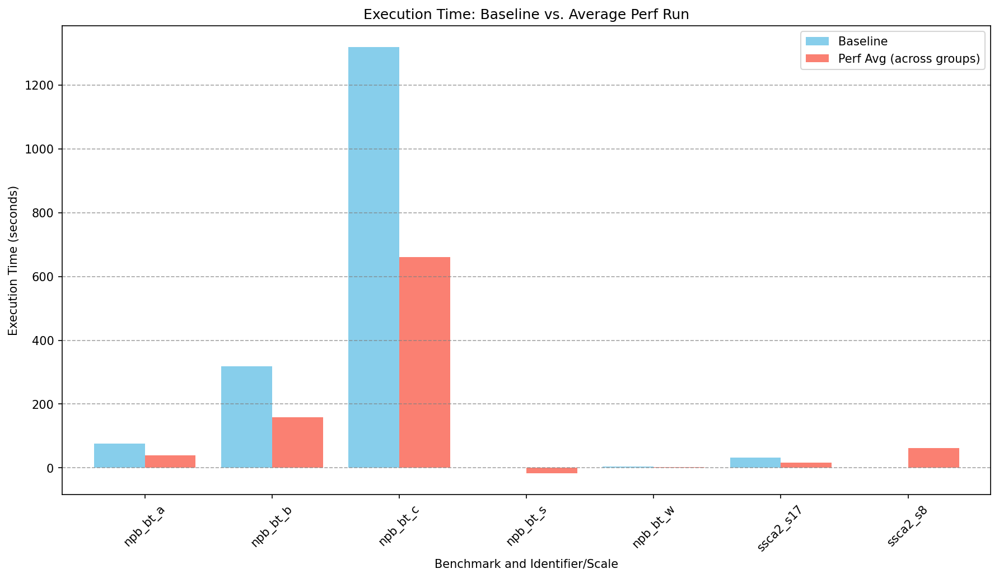
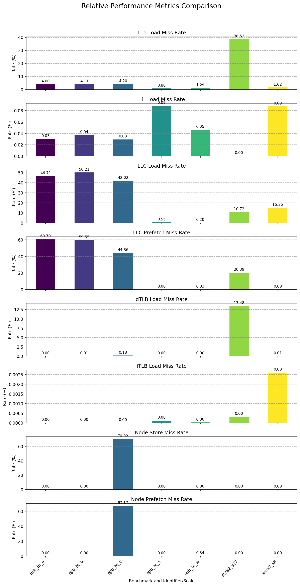

# Performance Analysis Report

*   **Slurm Logs:** `/scratch/cb761223/exercises/sheet04/perf/slurm_logs`
*   **Perf Outputs:** `/scratch/cb761223/exercises/sheet04/perf/perf_outputs`
*   **Report Generated:** `2025-03-31 21:14:01`

## Execution Time and Perf Overhead

Compares baseline execution time with the time taken for each `perf stat` group run. Overhead is relative to the baseline.

| full_id   |   Baseline Time (s) |   Perf Grp 1 Time (s) |   Perf Grp 2 Time (s) |   Perf Grp 3 Time (s) |   Perf Grp 4 Time (s) |   Perf Grp 5 Time (s) |   Perf Grp 6 Time (s) |   Perf Grp 7 Time (s) |   Avg. Overhead (%) |
|:----------|--------------------:|----------------------:|----------------------:|----------------------:|----------------------:|----------------------:|----------------------:|----------------------:|--------------------:|
| npb_bt_a  |               75.95 |                 79.30 |                 76.35 |                 76.86 |                 76.95 |                 76.62 |                 76.57 |                 76.64 |                1.43 |
| npb_bt_b  |              318.10 |                317.31 |                317.09 |                317.73 |                322.43 |                315.64 |                317.40 |                322.76 |                0.16 |
| npb_bt_c  |             1319.23 |               1307.84 |               1318.12 |               1320.76 |               1311.26 |               1325.30 |               1309.84 |               1355.40 |                0.15 |
| npb_bt_s  |                0.88 |                  0.98 |                  1.05 |                  0.29 |                  0.99 |                  0.30 |                  0.18 |                  0.15 |              -36.07 |
| npb_bt_w  |                3.23 |                  3.26 |                  3.32 |                  3.36 |                  3.30 |                  3.27 |                  3.26 |                  3.29 |                2.09 |
| ssca2_s17 |               32.30 |                 32.24 |                 32.37 |                 31.82 |                 32.37 |                 32.21 |                 32.19 |                 32.34 |               -0.26 |
| ssca2_s8  |                0.02 |                  0.06 |                  0.04 |                  0.05 |                  0.04 |                  0.05 |                  0.04 |                  0.04 |              123.81 |

### Time Comparison Plot

## Aggregated Performance Counters (Raw Values)

Total counts for each hardware event, summed across all `perf stat` groups for a given benchmark run. Values are raw counts (N/A indicates the counter was missing, unsupported, or NaN in all groups).

| full_id   |   L1-dcache-load-misses |   L1-dcache-loads |   L1-dcache-prefetches |   L1-dcache-store-misses |   L1-icache-load-misses |   L1-icache-loads |   LLC-load-misses |        LLC-loads |   LLC-prefetch-misses |   LLC-prefetches |   LLC-store-misses |   branch-load-misses |   dTLB-load-misses |   dTLB-loads |   dTLB-stores |   iTLB-load-misses |   iTLB-loads |      node-loads |   node-prefetch-misses |   node-prefetches |   node-store-misses |    node-stores |
|:----------|------------------------:|------------------:|-----------------------:|-------------------------:|------------------------:|------------------:|------------------:|-----------------:|----------------------:|-----------------:|-------------------:|---------------------:|-------------------:|-------------:|--------------:|-------------------:|-------------:|----------------:|-----------------------:|------------------:|--------------------:|---------------:|
| npb_bt_a  |             6.87741e+09 |       1.71882e+11 |                      0 |              2.42168e+09 |             4.46081e+07 |       1.47629e+11 |       3.00999e+08 |      6.44452e+08 |           4.80484e+08 |      7.90358e+08 |        2.93789e+07 |          5.01172e+09 |        1.12999e+06 |  1.71882e+11 |   7.55889e+10 |              19602 |  4.06238e+11 |     3.11593e+08 |          691           |       4.76087e+08 |         0           |    2.91382e+07 |
| npb_bt_b  |             2.94415e+10 |       7.16757e+11 |                      0 |              1.00393e+10 |             2.31321e+08 |       6.16712e+11 |       1.30557e+09 |      2.60015e+09 |           2.0672e+09  |      3.47156e+09 |        1.17132e+08 |          2.51731e+10 |        7.92706e+07 |  7.16757e+11 |   3.14756e+11 |              70873 |  1.69371e+12 |     1.32786e+09 |         9234           |       2.06662e+09 |         0           |    1.17657e+08 |
| npb_bt_c  |             1.22952e+11 |       2.92471e+12 |                      0 |              4.06095e+10 |             7.38815e+08 |       2.5092e+12  |       5.19914e+09 |      1.23717e+10 |           8.56387e+09 |      1.93076e+10 |        4.91002e+08 |          8.3869e+10  |        5.40403e+09 |  2.92471e+12 |   1.28321e+12 |             149995 |  6.9103e+12  |     5.21599e+09 |            5.46556e+09 |       8.1363e+09  |         3.60221e+08 |    5.14464e+08 |
| npb_bt_s  |             1.91605e+06 |       2.39727e+08 |                      0 |         241861           |        182864           |       2.07107e+08 |    1169           | 212077           |           6           | 589155           |       77           |          7.51585e+06 |      712           |  2.39727e+08 |   1.06874e+08 |                675 |  5.68199e+08 |   434           |            0           |     493           |         0           |    0           |
| npb_bt_w  |             1.21457e+08 |       7.90648e+09 |                      0 |              3.75324e+07 |             3.17497e+06 |       6.82246e+09 |   28033           |      1.37074e+07 |        8568           |      3.27055e+07 |      950           |          2.34336e+08 |   136545           |  7.90648e+09 |   3.50032e+09 |               3253 |  1.8701e+10  | 15029           |           90           |   26865           |         0           | 1578           |
| ssca2_s17 |             4.27884e+09 |       1.11054e+10 |                      0 |              6.52717e+08 |        213477           |       3.10883e+10 |       2.9733e+08  |      2.77297e+09 |           1.10835e+06 |      5.43534e+06 |        4.26931e+07 |          1.14432e+10 |        1.49755e+09 |  1.11054e+10 |   2.63702e+09 |             109690 |  3.45429e+10 |     2.89866e+08 |            0           |       1.01258e+06 |         0           |    4.16205e+07 |
| ssca2_s8  |        103833           |       6.41197e+06 |                      0 |          15103           |         16430           |       1.87896e+07 |     569           |   3732           |           0           |   2240           |        0           |          7.20616e+06 |      665           |  6.41196e+06 |   1.77662e+06 |                682 |  2.61154e+07 |   197           |            0           |     463           |         0           |    0           |

## Relative Performance Metrics

Key relative metrics calculated from the aggregated counters (N/A indicates the metric could not be calculated, e.g., due to missing counters or division by zero).

| full_id   |   L1d_Load_Miss_Rate |   L1d_Store_Miss_Rate |   L1d_Prefetch_Miss_Rate |   L1i_Load_Miss_Rate |   LLC_Load_Miss_Rate |   LLC_Store_Miss_Rate |   LLC_Prefetch_Miss_Rate |   Branch_Load_Miss_Rate |   dTLB_Load_Miss_Rate |   dTLB_Store_Miss_Rate |   iTLB_Load_Miss_Rate |   Node_Load_Miss_Rate |   Node_Store_Miss_Rate |   Node_Prefetch_Miss_Rate |   CPI |
|:----------|---------------------:|----------------------:|-------------------------:|---------------------:|---------------------:|----------------------:|-------------------------:|------------------------:|----------------------:|-----------------------:|----------------------:|----------------------:|-----------------------:|--------------------------:|------:|
| npb_bt_a  |             4.00125  |                   nan |                      nan |           0.0302165  |            46.7061   |                   nan |              60.7931     |                     nan |           0.000657424 |                    nan |           4.82525e-06 |                   nan |                 0      |               0.000145142 |   nan |
| npb_bt_b  |             4.1076   |                   nan |                      nan |           0.0375088  |            50.2116   |                   nan |              59.5466     |                     nan |           0.0110596   |                    nan |           4.18449e-06 |                   nan |                 0      |               0.000446817 |   nan |
| npb_bt_c  |             4.20391  |                   nan |                      nan |           0.0294442  |            42.0246   |                   nan |              44.355      |                     nan |           0.184772    |                    nan |           2.1706e-06  |                   nan |                70.0186 |              67.175       |   nan |
| npb_bt_s  |             0.799262 |                   nan |                      nan |           0.0882944  |             0.551215 |                   nan |               0.00101841 |                     nan |           0.000297005 |                    nan |           0.000118796 |                   nan |                 0      |               0           |   nan |
| npb_bt_w  |             1.53617  |                   nan |                      nan |           0.0465371  |             0.204511 |                   nan |               0.0261974  |                     nan |           0.001727    |                    nan |           1.73948e-05 |                   nan |                 0      |               0.335008    |   nan |
| ssca2_s17 |            38.5292   |                   nan |                      nan |           0.00068668 |            10.7224   |                   nan |              20.3916     |                     nan |          13.4849      |                    nan |           0.000317548 |                   nan |                 0      |               0           |   nan |
| ssca2_s8  |             1.61936  |                   nan |                      nan |           0.0874419  |            15.2465   |                   nan |               0          |                     nan |           0.0103713   |                    nan |           0.00261149  |                   nan |                 0      |               0           |   nan |

## Explanation of Calculated Relative Metrics

The relative metrics are calculated using the aggregated raw counters as follows:

*   **L1d_Load_Miss_Rate (%)**: `(L1-dcache-load-misses / L1-dcache-loads) * 100`
*   **L1d_Store_Miss_Rate (%)**: `(L1-dcache-store-misses / L1-dcache-stores) * 100`
*   **L1d_Prefetch_Miss_Rate (%)**: `(L1-dcache-prefetch-misses / L1-dcache-prefetches) * 100`
*   **L1i_Load_Miss_Rate (%)**: `(L1-icache-load-misses / L1-icache-loads) * 100`
*   **LLC_Load_Miss_Rate (%)**: `(LLC-load-misses / LLC-loads) * 100`
*   **LLC_Store_Miss_Rate (%)**: `(LLC-store-misses / LLC-stores) * 100`
*   **LLC_Prefetch_Miss_Rate (%)**: `(LLC-prefetch-misses / LLC-prefetches) * 100`
*   **Branch_Load_Miss_Rate (%)**: `(branch-load-misses / branch-loads) * 100` (Note: This might represent branch *misses* if `branch-misses` event was used instead of `branch-load-misses`)
*   **dTLB_Load_Miss_Rate (%)**: `(dTLB-load-misses / dTLB-loads) * 100`
*   **dTLB_Store_Miss_Rate (%)**: `(dTLB-store-misses / dTLB-stores) * 100`
*   **iTLB_Load_Miss_Rate (%)**: `(iTLB-load-misses / iTLB-loads) * 100`
*   **Node_Load_Miss_Rate (%)**: `(node-load-misses / node-loads) * 100` (Often relates to NUMA remote memory accesses)
*   **Node_Store_Miss_Rate (%)**: `(node-store-misses / node-stores) * 100` (Often relates to NUMA remote memory accesses)
*   **Node_Prefetch_Miss_Rate (%)**: `(node-prefetch-misses / node-prefetches) * 100` (Often relates to NUMA remote memory accesses)
*   **CPI (Cycles Per Instruction)**: `cycles / instructions` (Lower is generally better)

### Relative Metrics Comparison Plot

Visual comparison of the calculated relative metrics.

