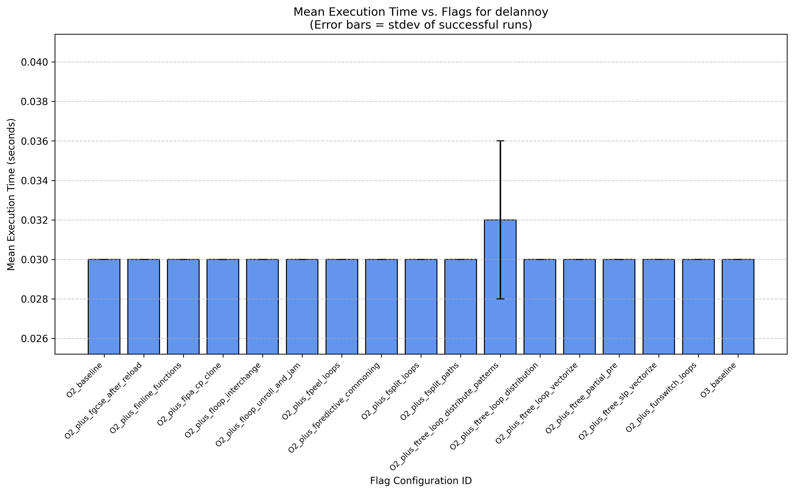
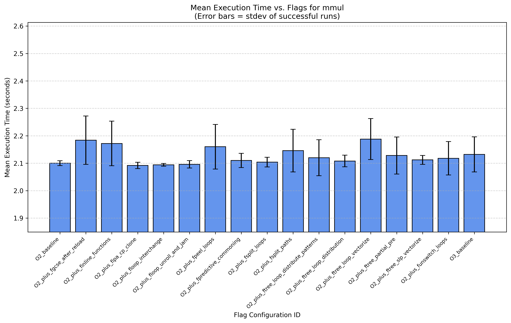
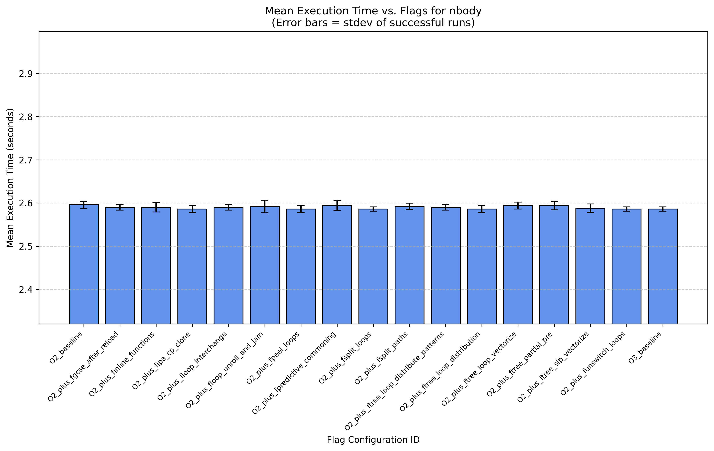
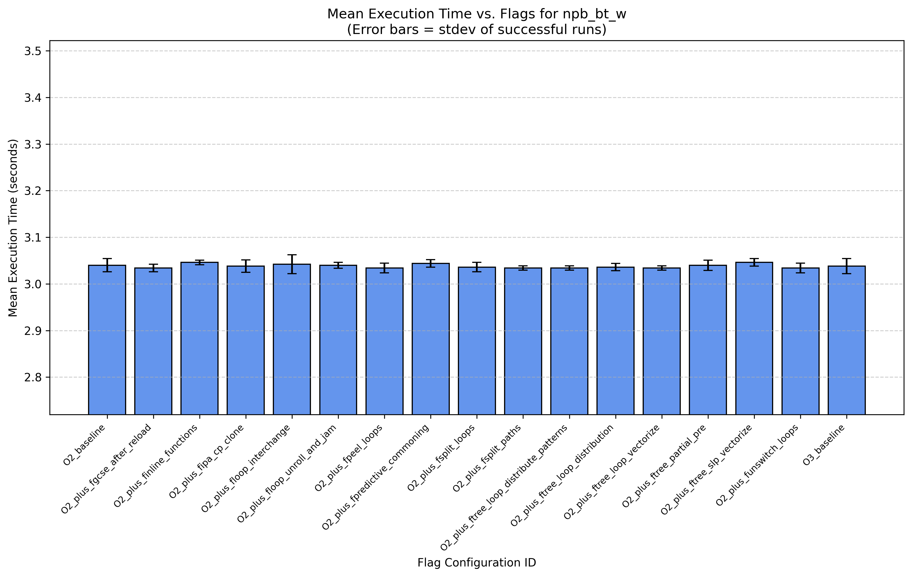
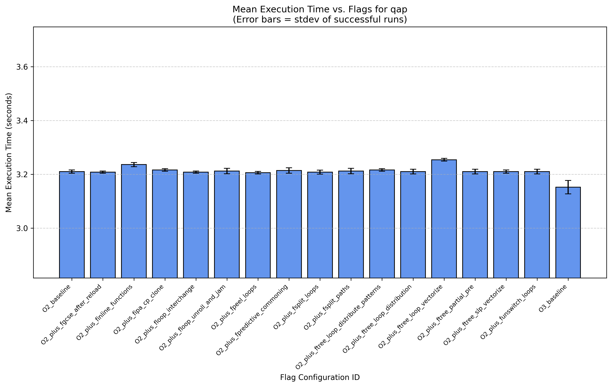
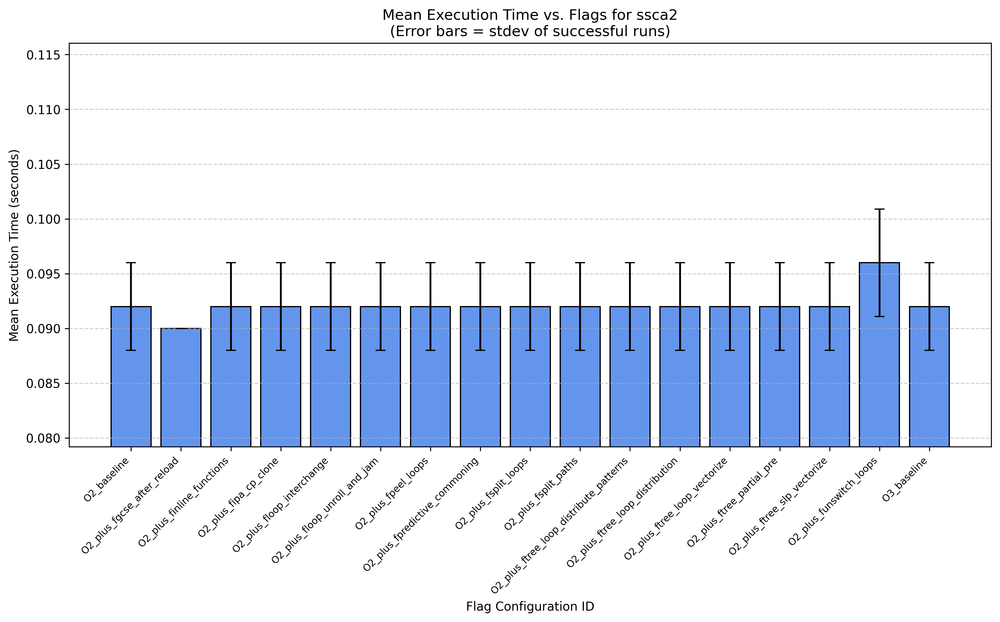

# GCC Optimization Benchmarking Report

Date Generated: 2025-04-06 18:12:04

## Configuration

*   **GCC Version:** Module `gcc/12.2.0-gcc-8.5.0-p4pe45v` (or similar)
*   **Programs Run:** delannoy, mmul, nbody, npb_bt_w, qap, ssca2
*   **Programs Analyzed:** delannoy, mmul, nbody, npb_bt_w, qap, ssca2
*   **Number of Runs Attempted per Configuration:** 5
*   **Flag Configurations Tested (17):**
    *   `O2_baseline`: `-O2`
    *   `O2_plus_fgcse_after_reload`: `-O2 -fgcse-after-reload`
    *   `O2_plus_finline_functions`: `-O2 -finline-functions`
    *   `O2_plus_fipa_cp_clone`: `-O2 -fipa-cp-clone`
    *   `O2_plus_floop_interchange`: `-O2 -floop-interchange`
    *   `O2_plus_floop_unroll_and_jam`: `-O2 -floop-unroll-and-jam`
    *   `O2_plus_fpeel_loops`: `-O2 -fpeel-loops`
    *   `O2_plus_fpredictive_commoning`: `-O2 -fpredictive-commoning`
    *   `O2_plus_fsplit_loops`: `-O2 -fsplit-loops`
    *   `O2_plus_fsplit_paths`: `-O2 -fsplit-paths`
    *   `O2_plus_ftree_loop_distribute_patterns`: `-O2 -ftree-loop-distribute-patterns`
    *   `O2_plus_ftree_loop_distribution`: `-O2 -ftree-loop-distribution`
    *   `O2_plus_ftree_loop_vectorize`: `-O2 -ftree-loop-vectorize`
    *   `O2_plus_ftree_partial_pre`: `-O2 -ftree-partial-pre`
    *   `O2_plus_ftree_slp_vectorize`: `-O2 -ftree-slp-vectorize`
    *   `O2_plus_funswitch_loops`: `-O2 -funswitch-loops`
    *   `O3_baseline`: `-O3`

## Summary Table: Mean Execution Time (seconds)

| FlagsID                                |   delannoy |   mmul |   nbody |   npb_bt_w |    qap |   ssca2 |
|:---------------------------------------|-----------:|-------:|--------:|-----------:|-------:|--------:|
| O2_baseline                            |     0.0300 | 2.1000 |  2.5960 |     3.0400 | 3.2100 |  0.0920 |
| O2_plus_fgcse_after_reload             |     0.0300 | 2.1840 |  2.5900 |     3.0340 | 3.2080 |  0.0900 |
| O2_plus_finline_functions              |     0.0300 | 2.1720 |  2.5900 |     3.0460 | 3.2360 |  0.0920 |
| O2_plus_fipa_cp_clone                  |     0.0300 | 2.0920 |  2.5860 |     3.0380 | 3.2160 |  0.0920 |
| O2_plus_floop_interchange              |     0.0300 | 2.0940 |  2.5900 |     3.0420 | 3.2080 |  0.0920 |
| O2_plus_floop_unroll_and_jam           |     0.0300 | 2.0960 |  2.5920 |     3.0400 | 3.2120 |  0.0920 |
| O2_plus_fpeel_loops                    |     0.0300 | 2.1600 |  2.5860 |     3.0340 | 3.2060 |  0.0920 |
| O2_plus_fpredictive_commoning          |     0.0300 | 2.1100 |  2.5940 |     3.0440 | 3.2140 |  0.0920 |
| O2_plus_fsplit_loops                   |     0.0300 | 2.1040 |  2.5860 |     3.0360 | 3.2080 |  0.0920 |
| O2_plus_fsplit_paths                   |     0.0300 | 2.1460 |  2.5920 |     3.0340 | 3.2120 |  0.0920 |
| O2_plus_ftree_loop_distribute_patterns |     0.0320 | 2.1200 |  2.5900 |     3.0340 | 3.2160 |  0.0920 |
| O2_plus_ftree_loop_distribution        |     0.0300 | 2.1080 |  2.5860 |     3.0360 | 3.2100 |  0.0920 |
| O2_plus_ftree_loop_vectorize           |     0.0300 | 2.1880 |  2.5940 |     3.0340 | 3.2540 |  0.0920 |
| O2_plus_ftree_partial_pre              |     0.0300 | 2.1280 |  2.5940 |     3.0400 | 3.2100 |  0.0920 |
| O2_plus_ftree_slp_vectorize            |     0.0300 | 2.1120 |  2.5880 |     3.0460 | 3.2100 |  0.0920 |
| O2_plus_funswitch_loops                |     0.0300 | 2.1180 |  2.5860 |     3.0340 | 3.2100 |  0.0960 |
| O3_baseline                            |     0.0300 | 2.1320 |  2.5860 |     3.0380 | 3.1520 |  0.0920 |

*(Table transposed for readability)*

*Note: Table shows mean time of successful runs. NaN indicates no successful runs were recorded/analyzed.*

## Performance Plots

Plots show mean execution time (successful runs) vs. flag configuration ID. Error bars = standard deviation.

### delannoy

### mmul

### nbody

### npb_bt_w

### qap

### ssca2

## Discussion

(Add your analysis and discussion here based on the results)

