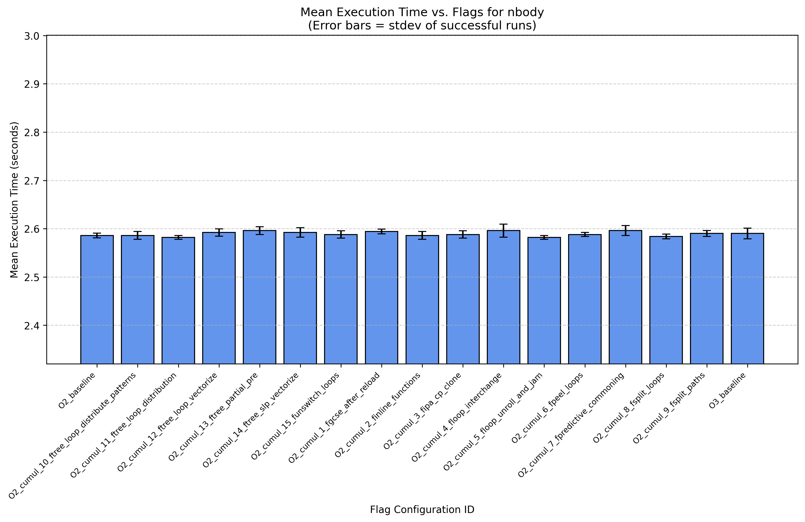

# A
## Exercise 
Benchmark each of the test cases at the `-O0`, `-O1`, `-O2`, `-O3`, `-Os` and `-Ofast` optimization levels.

## Summary Table: Mean Execution Time (seconds)

| Program  |      O0 |     O1 |     O2 |     O3 |     Os |  Ofast |
| :------- | ------: | -----: | -----: | -----: | -----: | -----: |
| delannoy |  0.0600 | 0.0400 | 0.0300 | 0.0320 | 0.0320 | 0.0300 |
| mmul     |  5.7700 | 2.0920 | 2.1380 | 2.0960 | 2.0920 | 2.0960 |
| nbody    |  4.4720 | 2.5900 | 2.5880 | 2.5940 | 2.5900 | 1.8900 |
| npb_bt_w |  3.0440 | 3.0360 | 3.0300 | 3.0480 | 3.0380 | 3.0380 |
| qap      | 14.0060 | 3.5880 | 3.2520 | 3.1440 | 3.6500 | 3.1720 |
| ssca2    |  0.0920 | 0.0920 | 0.0920 | 0.0920 | 0.0920 | 0.0940 |

*Note: Table shows mean time of successful runs. NaN indicates no successful runs were recorded/analyzed.*

## Performance Plots

Plots show mean execution time (successful runs) vs. flag configuration ID. Error bars = standard deviation.

### delannoy

### mmul

### nbody

### qap

### npb_bt_w

### ssca2

## Discussion

For each program, the performance plots show how the execution time varies with different optimization flags. The following observations can be made:

- For `npb_bt_w`, the execution time remains relatively stable across all optimization flags, indicating that the program may not benefit significantly from compiler optimizations.
- For `ssca2` the execution time is consistent across all flags, suggesting that the program's performance is not heavily influenced by compiler optimizations.
`
For the rest of the programs, there are noticeable differences in excecution time. 
In general the flags from O0 to O1-Ofast show a big decrease in execution time. 

The `Ofast` flag seem to provide the best performace with significantly lower execution time for`nbody`.

For the rest `01`, `O2`, `O3`, `Ofast`  show similar performance.

# B 
## Exercise 
Determine the set of compiler flags which changes when going from `-O2` to `-O3`. It is relatively small (at least compared to the total available amount of options).

Write a script or program which, starting from `-O2`, individually toggles these options to their `-O3` levels, trying all the options in turn and recording the resulting performance.

- Which of the options is the most meaningful for each of the programs?
- For the top 3 most impactful options across all test cases, read up on exactly what they do and try to reason about why they are effective for the given test cases.

## Flags
The flags that are in O3 but not in O2 are:
- `-fgcse-after-reload`
- `-finline-functions`
- `-fipa-cp-clone`
- `-floop-interchange`
- `-floop-unroll-and-jam`
- `-fpeel-loop`
- `-fpredictive-commoning`
- `-fsplit-loops`
- `-fplist-paths`
- `-ftree-loop-distribute-patterns`
- `-ftree-loop-distribution`
- `-ftree-loop-vectorize`
- `-ftree-partial-pre`
- `-ftree-slp-vectorize`
- `-funswitch-loops`

## Discussion 
I put the discussion here for the below results because there are a lot of flags and it is hard to see the impact of each flag.
Here's a summary based on your findings:

### Objective: To understand the impact of compiler flags enabled by −O3−O3 but not −O2−O2.
### Methodology: Flags were added both cumulatively (in alphabetical order) and individually to an −O2−O2 baseline.
### Key Findings:
- Benchmark Sensitivity: `nbody`, `npb_bt_w`, and `ssca2` showed negligible performance changes when these individual __−O3__ flags were added (either cumulatively or individually), consistent with their relative insensitivity to optimization levels beyond **−O1/−O2** observed in Exercise A.

- Cumulative Effects
  - For mmul, cumulative addition showed performance improvements, particularly when **-finline-functions, -fipa-cp-clone, and -ftree-loop-vectorize** were added in sequence.

  - For qap, a significant improvement occurred late in the cumulative sequence, primarily associated with adding **-ftree-loop-vectorize and -ftree-partial-pre**.
  
  - For delannoy, cumulative additions generally resulted in slightly slower execution compared to the **−O2** baseline.
  
- Individual Flag Effects:
  When added individually to **−O2**, most flags had little impact or even negatively impacted performance for benchmarks like mmul and qap. For instance, **-ftree-loop-vectorize** increased execution time for both mmul and qap when added alone, despite being part of the beneficial **−O3** combination.
  
  Only a few flags showed minor individual benefits (e.g., -fipa-cp-clone for mmul).

- Flag Interaction: 
The contrast between cumulative/final **−O3** results and individual flag results strongly suggests that the performance gains of **−O3** over **−O2** (for sensitive programs like mmul and qap) arise from the combined interaction of multiple optimization flags, rather than the dominant effect of any single flag. Some flags might require others to be enabled to show their benefit.

## Results Cummulative Flags

This means we add each flag one after the other alphabetically in the script 
Now of course just doing this alphabetically can generate a few problems there might be flags that are dependent on each other or that are not compatible with each other.

| FlagsID                                    | delannoy |   mmul |  nbody | npb_bt_w |    qap |  ssca2 |
| :----------------------------------------- | -------: | -----: | -----: | -------: | -----: | -----: |
| O2_baseline                                |   0.0260 | 2.1560 | 2.5860 |   3.0440 | 3.2100 | 0.0940 |
| O2_cumul_1_fgcse_after_reload              |   0.0280 | 2.1200 | 2.5940 |   3.0360 | 3.2180 | 0.0920 |
| O2_cumul_2_finline_functions               |   0.0280 | 2.1020 | 2.5860 |   3.0380 | 3.2320 | 0.0920 |
| O2_cumul_3_fipa_cp_clone                   |   0.0300 | 2.0960 | 2.5880 |   3.0280 | 3.2420 | 0.0920 |
| O2_cumul_4_floop_interchange               |   0.0300 | 2.1200 | 2.5960 |   3.0420 | 3.2340 | 0.0920 |
| O2_cumul_5_floop_unroll_and_jam            |   0.0300 | 2.1300 | 2.5820 |   3.0340 | 3.2400 | 0.0920 |
| O2_cumul_6_fpeel_loops                     |   0.0320 | 2.1500 | 2.5880 |   3.0420 | 3.2420 | 0.0920 |
| O2_cumul_7_fpredictive_commoning           |   0.0300 | 2.1660 | 2.5960 |   3.0340 | 3.2460 | 0.0940 |
| O2_cumul_8_fsplit_loops                    |   0.0300 | 2.1820 | 2.5840 |   3.0500 | 3.2380 | 0.0920 |
| O2_cumul_9_fsplit_paths                    |   0.0300 | 2.1240 | 2.5900 |   3.0400 | 3.2420 | 0.0960 |
| O2_cumul_10_ftree_loop_distribute_patterns |   0.0300 | 2.0940 | 2.5860 |   3.0340 | 3.2380 | 0.0920 |
| O2_cumul_11_ftree_loop_distribution        |   0.0300 | 2.1280 | 2.5820 |   3.0400 | 3.2460 | 0.0920 |
| O2_cumul_12_ftree_loop_vectorize           |   0.0320 | 2.0880 | 2.5920 |   3.0380 | 3.1520 | 0.0940 |
| O2_cumul_13_ftree_partial_pre              |   0.0300 | 2.1280 | 2.5960 |   3.0360 | 3.1440 | 0.0920 |
| O2_cumul_14_ftree_slp_vectorize            |   0.0300 | 2.1320 | 2.5920 |   3.0340 | 3.1440 | 0.0920 |
| O2_cumul_15_funswitch_loops                |   0.0300 | 2.1540 | 2.5880 |   3.0340 | 3.1520 | 0.0920 |
| O3_baseline                                |   0.0300 | 2.0900 | 2.5900 |   3.0300 | 3.1400 | 0.0920 |

*Note: Table shows mean time of successful runs. NaN indicates no successful runs were recorded/analyzed.*

1. For dellanoy allt he flags made the performance worse as seen in the first exercise that O3 is worse than O2. 
Habing only `-fgcse-after-reload` and `-finline-functions` makes it slightly less worse but still worse than O2. 
1. For mmul the performance is similar to the first exercise. The flags `-finline-functions` and `-fipa_cp_clone` and `-ftree_loop_vectorize` seem to have the most impact.  
2. For nbody, the performance is nearly the same for all the flags. 
3. For npb_bt_w, the performance is nearly the same for all the flags
4. For qap, `-ftree_loop_vectorize`, `-ftree-partia-pre`, `-ftree_slp_vectorize` and `-funswitch_loops` seem to have the most impact.
5. For ssca2, the performance is nearly the same for all the flags.

## Flags explainations 
- `-fgcse-after-reload`: This flag enables global common subexpression elimination after reload, which can help reduce redundant calculations. This optimization identifies redundant calculations across the code and replaces them with a single calculation, which improves performance.
- `-finline-functions`: This flag enables function inlining, which can improve performance by replacing function calls with the actual function code.
- `-fipa-cp-clone`: This flag enables interprocedural analysis for function cloning, which can help optimize function calls.
- `-ftree_loop_vectorize`: This flag enables loop vectorization, which can improve performance by converting loops into vector operations.
- `-ftree_partial_pre`: This flag enables partial redundancy elimination, which can help reduce redundant calculations in loops.
- `-ftree_slp_vectorize`: This flag enables superword level parallelism vectorization, which can improve performance by converting loops into vector operations.
- `-funswitch-loops`: This flag enables loop unswitching, which can help optimize loops by moving invariant code outside the loop. If a loop contains a conditional statement that does not change during the execution of the loop, the loop can be unswitched, creating two versions of the loop, one for each condition. This can allow for better optimization of each version of the loop.

### delannoy

### mmul

### nbody

### npb_bt_w

### qap

### ssca2

## Adding each flag individually
The following table shows the performance of each flag when added individually to the `O2` baseline. The flags are listed in the order they were applied, and the execution time is shown for each program.

| FlagsID                                | delannoy |   mmul |  nbody | npb_bt_w |    qap |  ssca2 |
| :------------------------------------- | -------: | -----: | -----: | -------: | -----: | -----: |
| O2_baseline                            |   0.0300 | 2.1000 | 2.5960 |   3.0400 | 3.2100 | 0.0920 |
| O2_plus_fgcse_after_reload             |   0.0300 | 2.1840 | 2.5900 |   3.0340 | 3.2080 | 0.0900 |
| O2_plus_finline_functions              |   0.0300 | 2.1720 | 2.5900 |   3.0460 | 3.2360 | 0.0920 |
| O2_plus_fipa_cp_clone                  |   0.0300 | 2.0920 | 2.5860 |   3.0380 | 3.2160 | 0.0920 |
| O2_plus_floop_interchange              |   0.0300 | 2.0940 | 2.5900 |   3.0420 | 3.2080 | 0.0920 |
| O2_plus_floop_unroll_and_jam           |   0.0300 | 2.0960 | 2.5920 |   3.0400 | 3.2120 | 0.0920 |
| O2_plus_fpeel_loops                    |   0.0300 | 2.1600 | 2.5860 |   3.0340 | 3.2060 | 0.0920 |
| O2_plus_fpredictive_commoning          |   0.0300 | 2.1100 | 2.5940 |   3.0440 | 3.2140 | 0.0920 |
| O2_plus_fsplit_loops                   |   0.0300 | 2.1040 | 2.5860 |   3.0360 | 3.2080 | 0.0920 |
| O2_plus_fsplit_paths                   |   0.0300 | 2.1460 | 2.5920 |   3.0340 | 3.2120 | 0.0920 |
| O2_plus_ftree_loop_distribute_patterns |   0.0320 | 2.1200 | 2.5900 |   3.0340 | 3.2160 | 0.0920 |
| O2_plus_ftree_loop_distribution        |   0.0300 | 2.1080 | 2.5860 |   3.0360 | 3.2100 | 0.0920 |
| O2_plus_ftree_loop_vectorize           |   0.0300 | 2.1880 | 2.5940 |   3.0340 | 3.2540 | 0.0920 |
| O2_plus_ftree_partial_pre              |   0.0300 | 2.1280 | 2.5940 |   3.0400 | 3.2100 | 0.0920 |
| O2_plus_ftree_slp_vectorize            |   0.0300 | 2.1120 | 2.5880 |   3.0460 | 3.2100 | 0.0920 |
| O2_plus_funswitch_loops                |   0.0300 | 2.1180 | 2.5860 |   3.0340 | 3.2100 | 0.0960 |
| O3_baseline                            |   0.0300 | 2.1320 | 2.5860 |   3.0380 | 3.1520 | 0.0920 |

### delannoy

### mmul

### nbody

### npb_bt_w

### qap

### ssca2

