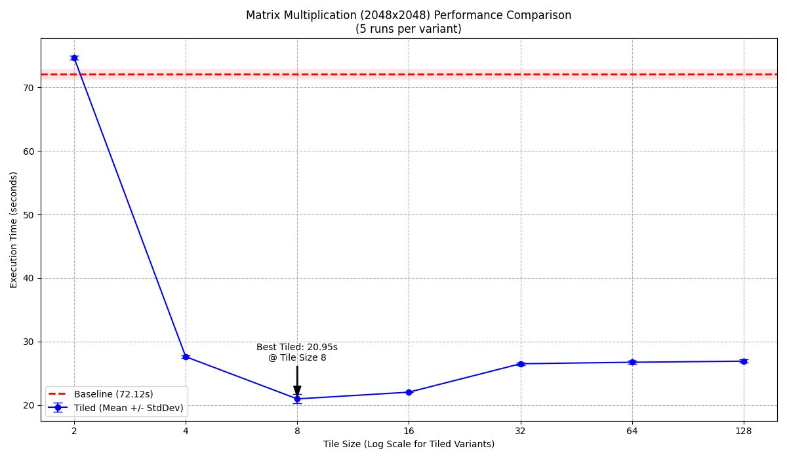

## A) MMUL Tiling

### Goal

The objective is to optimize the provided matrix multiplication C code (`mmul`) using loop tiling. We need to choose appropriate loops for tiling, justify the choice based on reuse distance, implement the tiling, test different tile sizes (on LCC3, hypothetically), and explain the results. The benchmark should use \(2048 \times 2048\) matrices.

### Background: Matrix Multiplication and Cache Locality

The standard matrix multiplication algorithm \(C = A \times B\) involves three nested loops:

```c
// Original loop structure
for (int i=0; i<N; i++) {        // Outer loop (rows of C, rows of A)
    for (int j=0; j<K; j++) {    // Middle loop (columns of C, columns of B)
        TYPE sum = 0;
        for (int k=0; k<M; k++) { // Inner loop (columns of A, rows of B)
            sum += A[i][k] * B[k][j];
        }
        C[i][j] = sum;
    }
}
```

1. C[i][j]: Accessed repeatedly within the inner k loop (write access at the end). Good temporal locality.

2. A[i][k]: For a fixed i, elements are accessed sequentially across columns (k changes). This exhibits good spatial locality as consecutive elements A[i][k] and A[i][k+1] are adjacent in memory. It's reused across the j loop.

3. B[k][j]: For a fixed j, elements are accessed down columns (k changes). This exhibits poor spatial locality. Elements B[k][j] and B[k+1][j] are \(K\) elements apart in memory (where \(K\) is the number of columns in B). If \(K\) is large, these accesses likely jump across different cache lines, potentially causing many cache misses. It's reused across the i loop.

The poor locality of accessing B is often the main performance bottleneck for large matrices.


To maximize benefits, we should tile the loops that carry the most reuse. In matrix multiplication, all three loops (i, j, k) contribute to data reuse.

- Tiling i and j keeps a tile of C in cache.
- Tiling i and k keeps a tile of A in cache.
- Tiling j and k keeps a tile of B in cache.
- 
Therefore, the most effective strategy is to tile all three loops (i, j, k). This partitions matrices A, B, and C into smaller square (or rectangular) tiles. The computation becomes a series of smaller matrix multiplications on these tiles.

The tiled loop structure looks like this:
```c
// Tiled loop structure
// Outer loops iterating over tiles
for (int ii = 0; ii < N; ii += TILE_SIZE) {
    for (int jj = 0; jj < K; jj += TILE_SIZE) {
        for (int kk = 0; kk < M; kk += TILE_SIZE) {
            // Inner loops iterating within a tile
            // Process tile C[ii:i, jj:j] using A[ii:i, kk:k] and B[kk:k, jj:j]
            for (int i = ii; i < MIN(ii + TILE_SIZE, N); ++i) {
                for (int j = jj; j < MIN(jj + TILE_SIZE, K); ++j) {
                    // Note: sum initialization moved or C[i][j] initialized before kk loop
                    for (int k = kk; k < MIN(kk + TILE_SIZE, M); ++k) {
                        C[i][j] += A[i][k] * B[k][j]; // Accumulate directly into C
                    }
                }
            }
        }
    }
}
```
Note: The inner loops j and k were swapped (i, k, j order within the tile computation). This often improves performance slightly by keeping A[i][k] in a register during the innermost j loop.

### Results 
--- Aggregated Results (Successful Runs) ---
| VariantLabel | MeanTime | StdDev | ValidRuns |
| ------------ | -------- | ------ | --------- |
| Baseline     | 71.834   | 0.531  | 5         |
| Tiled (8)    | 20.588   | 0.075  | 5         |
| Tiled (16)   | 22.062   | 0.073  | 5         |
| Tiled (32)   | 26.646   | 0.209  | 5         |
| Tiled (64)   | 26.684   | 0.214  | 5         |
| Tiled (128)  | 26.920   | 0.156  | 5         |
--------------------------------------------



## B) Cache Investigation
Idea is to measure the time it takes to access data residing in memory blocks of varying sizes. 
By systematically inceasing the block size, we force the data to reside in different levels of the memory hierarchy (L1, L2, L3, main memory). When the accessed block size exceeds the capacity of a particular cache level, subsequent accesses will result in cache misses for that level, 
requiring data to be fetched from the block size should reveal distinct "steps" or jumps in latency 
corresponding to the sizes of the different cache levels. 

### Pointer Chasing
To accurately measure latency (the time for a single access) rather than bandwidth (data transfer rate), and to mitigate the effects of hardware prefetchers and out-of-order execution, a common technique is pointer chasing.

#### Setup 
1. Allocate a memory block of the desired size  (S bytes)
2. Treat this block as an array of pointers. Let the numbver of elements be N = S/sizeof(TYPE)
3. Create a random permutation of the indices 0,1,...,N-1. This means shuffling the order of elements randomly. 
4. Arrange the elements (pointers or indices) in the allocated block according ot this random permuatation, forming a large cycle or linked list. For example, if using indices, the value stored at 
array[i] would be the index of the next element to access. If the permutation maps i to j, k to i, and m to k, then array[k] = i, array[i] = j, and array[j] = m.

### Measurement: 
1. Select a starting index/pointer. 
2. Start a higher-resultion timer. 
3. Traverese the linked list by repeatedly "chasing" the pointers/indices for a large, fixed number of steps (K). For example: current_inex = array[current_index]. This loop runs K times. 
4. Stop the timer 
5. Calculate the average latency per access: Latency = (Total Time)/K

### Avoiding Unintended Effects: 
- **Hardware Prefetching:** Pointer chasing largely defeats prefetchers. Because the address of the next access (``array[current_index]``) depends on the value loaded from the current access, the CPU cannot easily predict the memory addresses far in advance. This creates a chain of dependent loads. 
- **Out-of-Order Execution:** While the CPU might execute other instructions out of order, the code pointer-chasing loop invovles dependent loads, limiting the benefits of out-of-order execution for hiding the latency of this specific chain.
- **Measurement Overhead:** By performing a very large number of accesses (K), within the timed loop, the overhead of starting/stopping the timer and the loop control itsefl becomes negligible compared to the total time spent wating for memory accesses. 
- **Cache State:** Running the traversal loop multiple times before the actual measurment can help "warm up" the cache, ensurng the data being measure is loaded into the cache hierarchy according to the block size being tested. The random nature of the access within the block helps ensure that the accesses are distributed across cache lines. 
- **Compiler Optimizations:** The pointer-chasing varaible (e.g., `current_index`) should be used after the loop (e.g, prnted or marked `volatile`) to prevent the compiler from optimizing the entire loop away if it deems the result unused. Compile with optmizations enabled (-02 or -03) to measure the performance of optimized code interacting with the hardware. 
- **Time Resolution:** Use a high-resolution clock