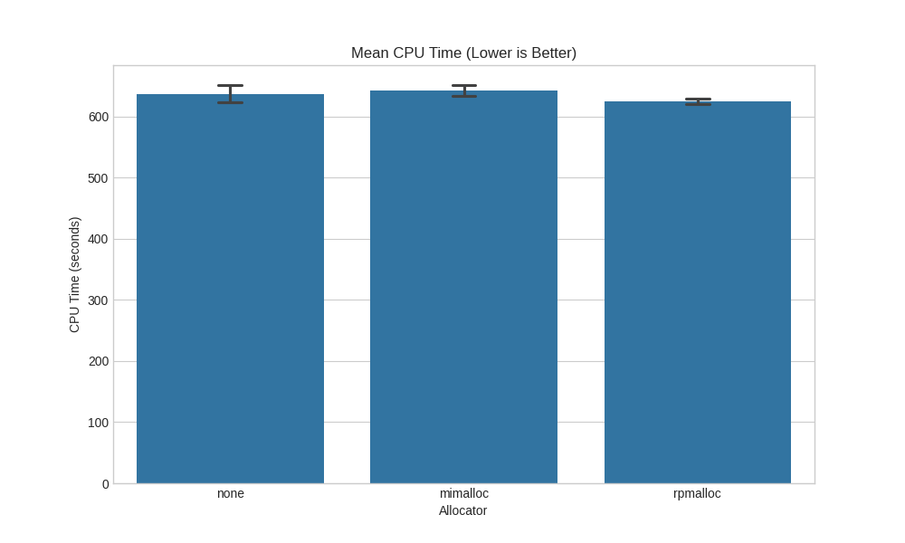
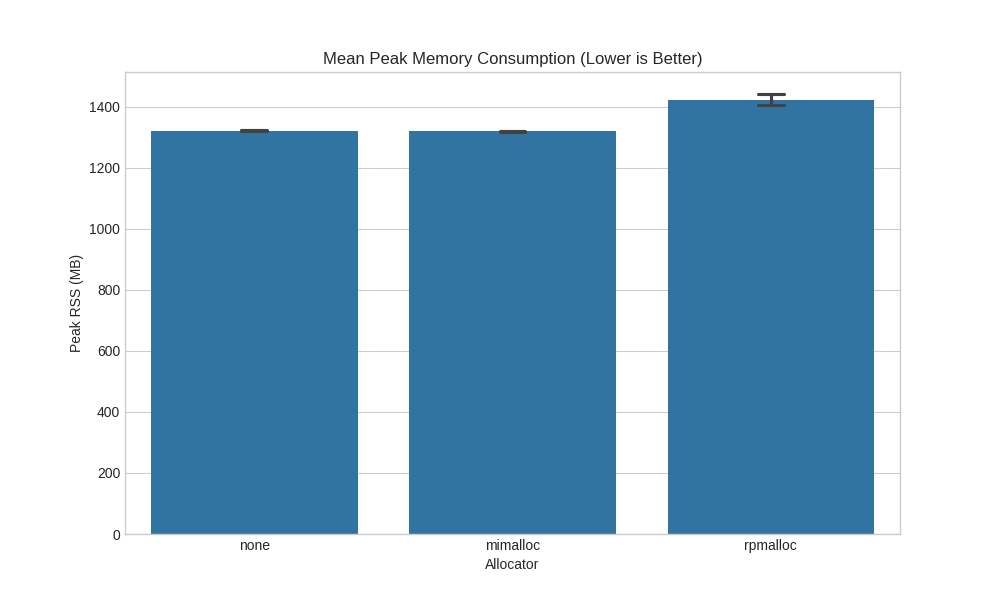
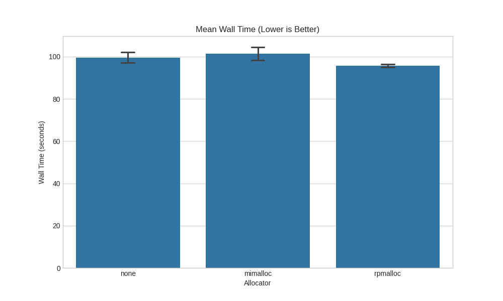
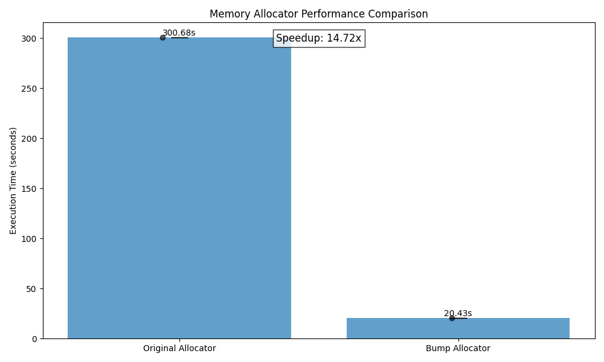

## A) Preloading General Allocators
### 1 Building the rpmalloc and mimalloc libraries. 
For mimalloc just follow the instructions, cmake and make to build. 
Rpmalloc with ninja will faile delete flags which fail in build.ninja file. 

### 2 Building with LD_Preload
For this i wrote a benchmark script which copies the allscale_api code into temp and builds it with the different allocators. 

```python
ninja_clean_cmd = ["ninja", "clean"]
run_command(ninja_clean_cmd, cwd=build_dir)

env = os.environ.copy()  # Important: Copy the environment
if allocator_so_path:
    env["LD_PRELOAD"] = str(allocator_so_path.resolve())
else:
    env.pop("LD_PRELOAD", None)  # Remove LD_PRELOAD if no allocator

ninja_build_cmd = ["/usr/bin/time", "-v", "ninja", "-j", str(SLURM_CPUS_PER_TASK)]
try:
    result = run_command(
        ninja_build_cmd,
        cwd=build_dir,
        env=env,
        capture_output=True,  
        check=True,
    )  
    logger.info(f"Ninja build succeeded: {result}")
    with open(metrics_file, "w") as metrics_output:
        metrics_output.write(result.stdout)
        metrics_output.write(result.stderr)
```

### Results




The Differences are not that big. 


## B) Implementing a special-purpose allocator
Implement a bump allocator working on an arena, and use it with this benchmark.

Bump allocator has an ARENA_SIZE and always allocates in a size of 8 bytes. 
Very simple bad granularity only whole ARENA can be freed. 


```cpp
void init_bump_allocator() {
    allocator.buffer = malloc(ARENA_SIZE);
    allocator.size = ARENA_SIZE;
    allocator.used = 0;
    pthread_mutex_init(&allocator.lock, NULL);
}

void* bump_malloc(size_t size) {
    pthread_mutex_lock(&allocator.lock);
    
    // Align to 8 bytes
    size = (size + 7) & ~7;
    
    // Check if we have enough space
    if (allocator.used + size > allocator.size) {
        pthread_mutex_unlock(&allocator.lock);
        return NULL; 
    }
    
    // Allocate memory
    void* ptr = allocator.buffer + allocator.used;
    allocator.used += size;
    
    pthread_mutex_unlock(&allocator.lock);
    return ptr;
}
```

This didn't work. 
For the lack of time the following code was then wrtten by gemini. 
It appears that a bit more padding is needed to align the address.

```cpp
if (size == 0) size = 1; 

pthread_mutex_lock(&allocator.lock);

// Align to 8 bytes (or more, e.g., _Alignof(max_align_t))
size_t effective_size = (size + 7) & ~7; 
char* current_ptr = allocator.buffer + allocator.used;
uintptr_t aligned_addr_val = ((uintptr_t)current_ptr + 7) & ~7;
char* aligned_ptr = (char*)aligned_addr_val;

// Calculate padding introduced by alignment
size_t padding = aligned_ptr - current_ptr;

if (allocator.used + padding + effective_size > allocator.size) {
    pthread_mutex_unlock(&allocator.lock);
    fprintf(stderr, "Bump allocator OOM: requested %zu, effective %zu, used %zu, arena %zu\n",
            size, effective_size, allocator.used, allocator.size);
    return NULL; 
}

// Allocate memory
allocator.used += padding + effective_size;

pthread_mutex_unlock(&allocator.lock);
return (void*)aligned_ptr;
```

./malloctest_original 1 500 1000000 10 1000

Execution time: 300.68 seconds


./malloctest_bump 1 500 1000000 10 1000

Execution time: 20.43 seconds



The bump allocator is much faster than the default allocator.
