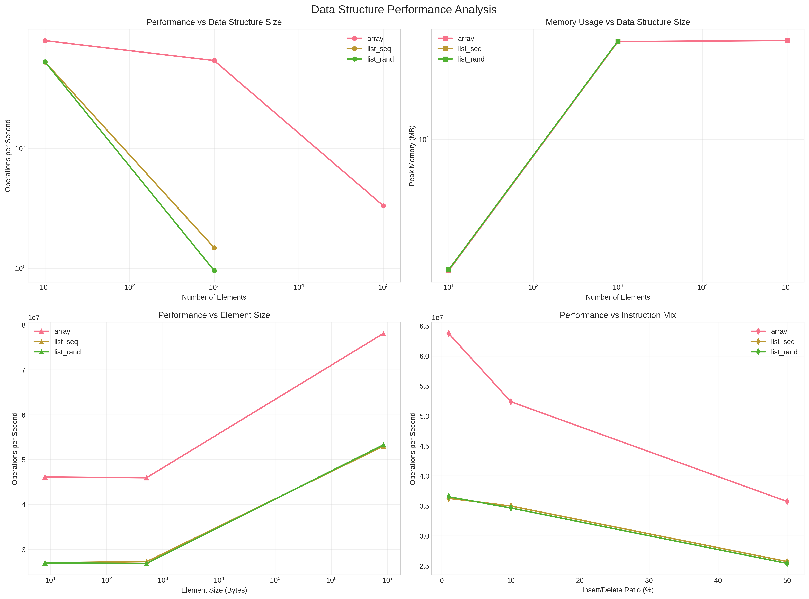
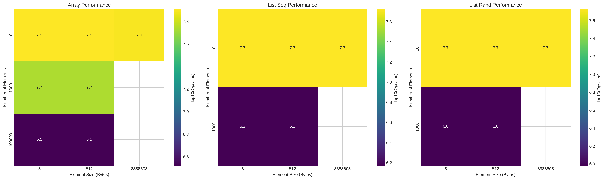
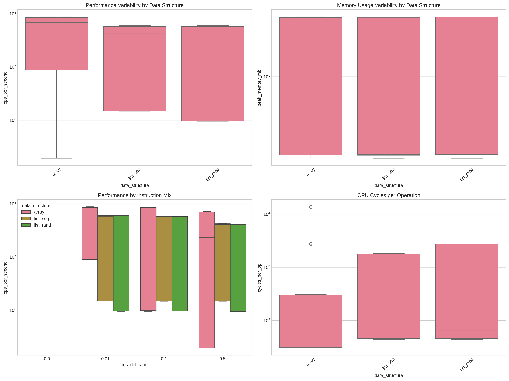

# A)
## Overview
This implementation creates a generic benchmark framework for measuring performance of different data structures (arrays, linked lists) under various operation mixes, designed to reveal counter-intuitive performance characteristics.

## Core Design

### **Generic Interface**
```c
typedef struct {
    void *data_structure;
    int (*get)(void *ds, size_t index);
    void (*set)(void *ds, size_t index, int value);
    void (*insert)(void *ds, size_t index, int value);
    void (*delete)(void *ds, size_t index);
    size_t *current_size;
} DataStructure;
```
Allows easy swapping between data structures without changing benchmark code.

### **Operation Mix Configuration**
- `read_write_ratio`: Controls percentage of read/write vs insert/delete operations
- `ins_del_ratio`: Controls percentage of total operations that are insert/delete
- Ensures 50/50 split within each category (reads/writes, inserts/deletes)

### **Minimum Spacing Implementation**
The key requirement: operations must be interleaved with minimum spacing rather than clustered.

**Algorithm**: Calculate pattern length based on operation ratios, then distribute operations evenly:
```c
// For 20% ins/del, 80% read/write:
// Pattern: read, write, read, write, insert, read, write, read, write, delete
size_t rw_per_id = read_write_count / ins_del_count;
pattern_length = rw_per_id + 1;
```

## Data Structure Implementations

### **Array** (`array.c`)
- **Get/Set**: O(1) direct access
- **Insert/Delete**: O(n) with `memmove()` for element shifting
- Pre-allocated with extra capacity for insertions
- Cache-friendly sequential memory layout

### **Linked List** (`linkedlist.c`)
- **All operations**: O(n) due to traversal requirement
- **Two allocation policies**:
  - **Sequential**: Nodes allocated in traversal order (better cache locality)
  - **Random**: Pre-allocated nodes shuffled for scattered memory layout (poor cache)
- **Immediate deallocation**: `free()` called immediately on deletion as required

## Benchmark Best Practices

### **Timing Accuracy**
- Uses `clock_gettime(CLOCK_MONOTONIC)` for nanosecond precision
- Optional CPU cycle counting with `rdtsc` instruction
- Cross-platform compatibility (Windows/Linux/macOS)

### **Compiler Optimization Prevention**
```c
checksum += value;                    // Use read values
ds->set(ds, index, i ^ checksum);     // Non-constant writes
```
Ensures operations cannot be optimized away.

```c
// BAD: Compiler might optimize
ds->set(ds, index, 42);           // Always same value

// GOOD: Compiler can't predict the value
ds->set(ds, index, i ^ checksum); // Value depends on loop iteration AND previous reads
```

### **Measurement Noise Reduction**
- **Warm-up phase**: 1000 operations before timing starts
- **Scaled operation counts**: More operations for smaller data structures
- **Linear traversal**: Predictable access pattern with wraparound

### **Memory Management**
- **Pre-initialization**: All structures start with N elements
- **Realistic allocation**: New nodes allocated/freed for each linked list operation
- **Proper cleanup**: All memory freed after benchmarking


## Usage
```bash
gcc -O2 -o benchmark main.c array.c linkedlist.c benchmark.c timing.c
./benchmark array 1000 0.8 0.2        # Array: 80% read/write, 20% ins/del
./benchmark list_seq 1000 0.8 0.2     # Sequential allocation
./benchmark list_rand 1000 0.8 0.2    # Random allocation
```

This implementation reveals how intuition about data structure performance often fails due to memory hierarchy effects, cache behavior, and operation complexity trade-offs.


# B)

This benchmark compares arrays against linked lists with sequential (list_seq) and 
random (list_rand) element allocation across varying element counts, element sizes, and instruction mixes (insert/delete vs. read/write operations).

### Setup: 
```python
DATA_STRUCTURES = ["array", "list_seq", "list_rand"]
INSTRUCTION_MIXES = [
    {"ins_del": 0.0, "read_write": 1.0},
    {"ins_del": 0.01, "read_write": 0.99},
    {"ins_del": 0.10, "read_write": 0.90},
    {"ins_del": 0.50, "read_write": 0.50},
]
ELEMENT_SIZES = [8, 512, 8*1024*1024]  # 8 Byte, 512 Byte, 8 MB
NUM_ELEMENTS = [10, 1000, 100000, 10000000]

for ds, mix, num_elem, elem_size in itertools.product(
    DATA_STRUCTURES, INSTRUCTION_MIXES, NUM_ELEMENTS, ELEMENT_SIZES
):
    if should_exclude_combination(ds, num_elem, elem_size):
        excluded_count += 1
        continue
        
    combinations.append({
        "data_structure": ds,
        "num_elements": num_elem,
        "element_size": elem_size,
        "ins_del_ratio": mix["ins_del"],
        "read_write_ratio": mix["read_write"],
        "estimated_memory_mb": estimate_memory_usage(num_elem, elem_size)
    })
```

This makes about 100 benchmarks. 
Run 3 times to get an average. 

__This took so long to run sequentielly on my local machine that i sadly wasn't able to finish the local benchmarking on time. So local benchmark is missing from this report. The following findings are only from LLC__

## Key Findings:







### Array Performance Dominance

Arrays consistently outperformed both types of linked lists in terms of operations per second (ops/sec) across most scenarios. This advantage was particularly notable with a larger number of elements (e.g., 1000) and when the workload included more insert/delete operations. For instance, with 1000 elements (8 bytes each) and a 50% insert/delete ratio, arrays achieved (~ 2.28 * 10^7) ops/sec, while list_seq and list_rand were significantly slower at (~ 1.48 * 10^6) and (~ 9.43 * 10^5) ops/sec, respectively.


### Scalability with Element Count
Performance for all data structures decreased as the number of elements grew. However, linked lists experienced a more drastic drop in ops/sec when scaling from 10 to 1000 elements compared to arrays. Arrays maintained substantially higher throughput even at 100,000 elements, where list benchmarks were largely incomplete.


### Impact of Insert/Delete Operations


- Arrays: 

  Showed a significant performance degradation as the insert/delete ratio increased (e.g., for 1000 elements, 8 bytes, ops/sec dropped from (~ 8.4 * 10^7) at 1% ins/del to (~ 2.3 * 10^7) at 50% ins/del). This is due to the overhead of shifting elements.
- Linked Lists: 
  
  While also affected, their performance was more stable across different insert/delete ratios for a fixed (larger) number of elements, but their absolute performance remained much lower than arrays.


### List Allocation Strategy
 Sequentially allocated lists (list_seq) generally performed slightly better than randomly allocated lists (list_rand), likely due to improved cache locality during traversal. This was more evident with 1000 elements.


### Element Size: 
For the completed tests (element sizes 8 bytes and 512 bytes), element size had a relatively minor impact on ops/sec for all data structures when the number of elements was small to moderate. Benchmarks with 8MB elements were mostly incomplete.


### Memory Usage: 
Peak memory usage was similar for all data structures with a small number of elements. For 1000 elements, all structures used around 39MB. For 100,000 elements, arrays also reported around 39MB, suggesting a significant constant memory overhead in the test setup or that the data structure itself was not the dominant memory consumer at that scale for arrays. Data for lists at 100,000 elements was largely unavailable (NaN).


In summary, despite the theoretical advantages of linked lists for insertions and deletions, arrays demonstrated superior practical performance in these benchmarks, benefiting from better cache utilization and lower overhead per operation, even with a notable percentage of modifications.


