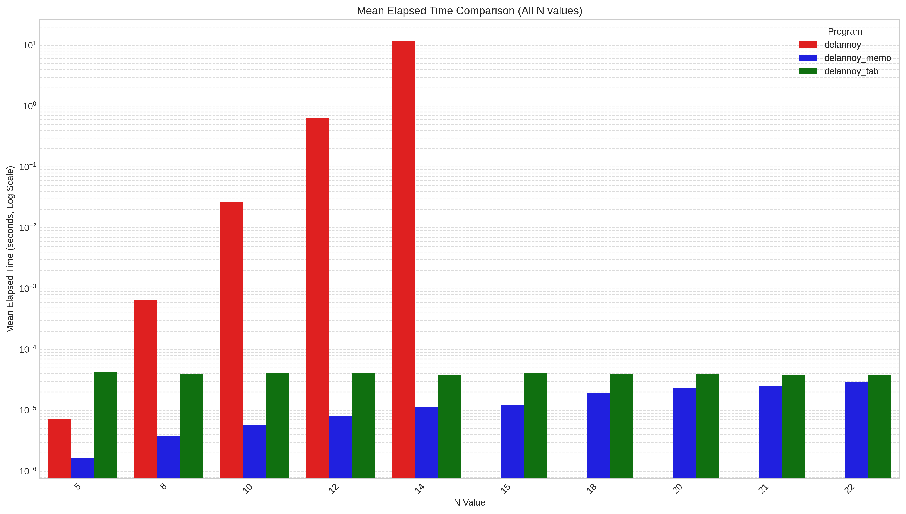
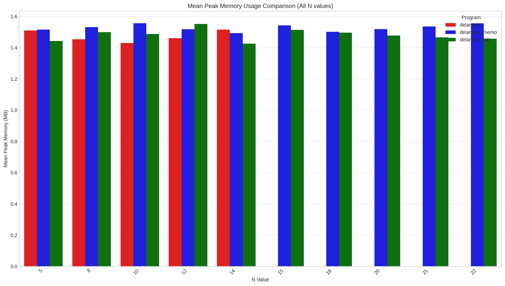

# Report Memo and Tabulation

## Memoization with Hash Table 
Memoization is a top-down approach where the results of function calls (subproblems) are cached (or "memoized"). When the function is called again with the same inputs, the cached result is returned instead of recomputing. In this implementation, a hash table stores the results for each unique \((x,y)\) pair.

```c
// Inside delannoy_memo(dn x, dn y)
if (x == 0 || y == 0) return 1; // Base case

// Check if result is already cached
dn cached = lookup_memo(memo_hash_table, x, y);
if (cached != 0) return cached;

// Compute recursively if not found
dn result = delannoy_memo(x-1, y) + delannoy_memo(x-1, y-1) + delannoy_memo(x, y-1);
store_memo(memo_hash_table, x, y, result); // Store new result
return result
```


## Tabulation
Tabulation is a bottom-up approach where solutions to subproblems are built iteratively, typically by filling a table. Each entry \(D(i,j)\) is computed using previously computed values according to the recurrence relation. This implementation uses an optimized approach requiring only \(O(N)\) space by keeping track of only the current and previous rows of the conceptual 2D table.

```c
// Inside delannoy_tabulation(dn x_max, dn y_max)
// ... initialize prev_row (for D(i, j-1)) and curr_row (for D(i,j)) ...
for (dn j = 1; j <= y_max; j++) { // Iterate through effective rows
    curr_row[0] = 1; // Base case D(0,j)
    for (dn i = 1; i <= x_max; i++) { // Iterate through columns
        // D(i,j) = D(i-1,j) + D(i-1,j-1) + D(i,j-1)
        curr_row[i] = prev_row[i] + prev_row[i-1] + curr_row[i-1];
    }
    // ... copy curr_row to prev_row for next iteration ...
}
// Result is in prev_row[x_max]
```

## Results
| Program       |   N |   Peak Memory (MB) |   Memory StdDev |   Internal Time (s) |
|:--------------|----:|-------------------:|----------------:|--------------------:|
| delannoy      |   5 |             1.5094 |          0.0652 |         7.159e-06   |
| delannoy      |   8 |             1.4531 |          0.0591 |         0.00065017  |
| delannoy      |  10 |             1.4289 |          0.0465 |         0.0260344   |
| delannoy      |  12 |             1.4602 |          0.0544 |         0.626551    |
| delannoy      |  14 |             1.5148 |          0.0155 |        11.9146      |
| delannoy_memo |   5 |             1.5148 |          0.0413 |         1.654e-06   |
| delannoy_memo |   8 |             1.5312 |          0.0132 |         3.8286e-06  |
| delannoy_memo |  10 |             1.5562 |          0.0261 |         5.687e-06   |
| delannoy_memo |  12 |             1.5172 |          0.0851 |         8.1418e-06  |
| delannoy_memo |  14 |             1.4922 |          0.0563 |         1.11664e-05 |
| delannoy_memo |  15 |             1.5422 |          0.0427 |         1.2499e-05  |
| delannoy_memo |  18 |             1.5008 |          0.0578 |         1.90418e-05 |
| delannoy_memo |  20 |             1.518  |          0.0766 |         2.34216e-05 |
| delannoy_memo |  21 |             1.5352 |          0.0646 |         2.51642e-05 |
| delannoy_memo |  22 |             1.5555 |          0.0347 |         2.87672e-05 |
| delannoy_tab  |   5 |             1.4422 |          0.0565 |         4.24174e-05 |
| delannoy_tab  |   8 |             1.4984 |          0.0525 |         3.98606e-05 |
| delannoy_tab  |  10 |             1.4867 |          0.0459 |         4.15042e-05 |
| delannoy_tab  |  12 |             1.5516 |          0.0388 |         4.14618e-05 |
| delannoy_tab  |  14 |             1.425  |          0.0448 |         3.77138e-05 |
| delannoy_tab  |  15 |             1.5133 |          0.0035 |         4.12582e-05 |
| delannoy_tab  |  18 |             1.4953 |          0.0476 |         3.99742e-05 |
| delannoy_tab  |  20 |             1.4773 |          0.0633 |         3.94486e-05 |
| delannoy_tab  |  21 |             1.4656 |          0.082  |         3.85658e-05 |
| delannoy_tab  |  22 |             1.457  |          0.0705 |         3.80844e-05 |





### Obersvations 

- The naive delannoy program's execution time grows extremely rapidly with N, becoming impractical for N > 12.
Both delannoy_memo and delannoy_tab (tabulation) show vastly superior performance, with internal execution times in the microsecond range even for N=22. This transforms the problem from exponential to polynomial time complexity (specifically, \(O(N^2)\) for computing \(D(N,N)\)).

- The delannoy_memo implementation appears slightly faster than delannoy_tab in these internal timings, though both are exceptionally fast. The overhead of hash table lookups versus direct array access and row copying might contribute to these subtle differences.

- Peak memory usage is relatively consistent across all three implementations for the tested N values. For delannoy_memo, this is the hash table size, and for delannoy_tab, it's the two rows of size N. The naive delannoy's memory is primarily stack space, which might not be fully reflected as "Peak Memory (MB)" by /usr/bin/time if the recursion depth is managed efficiently by the system or if it's shallow for small N. The internal timing is the most critical metric for comparing the algorithmic efficiency here.